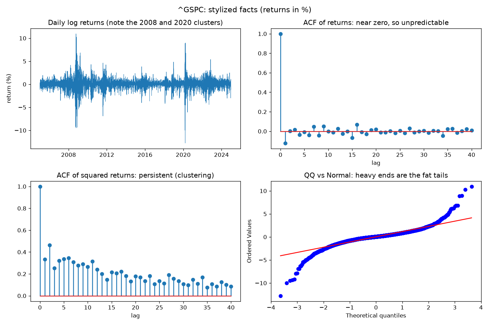
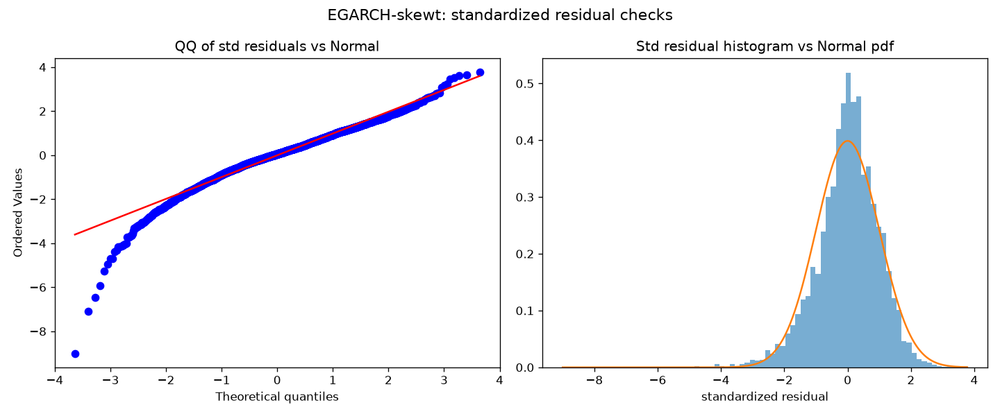
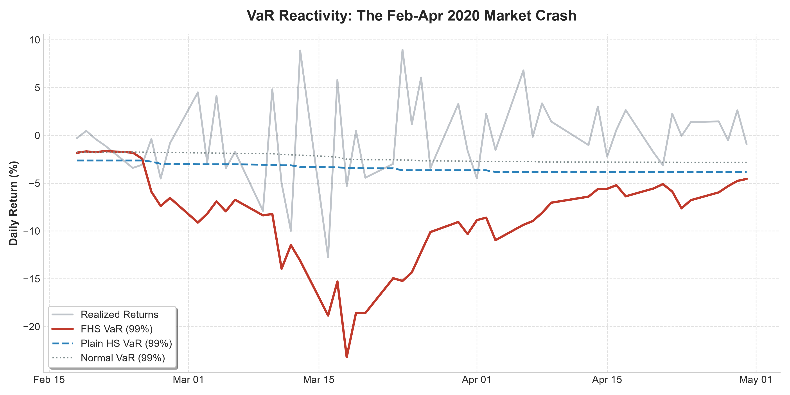
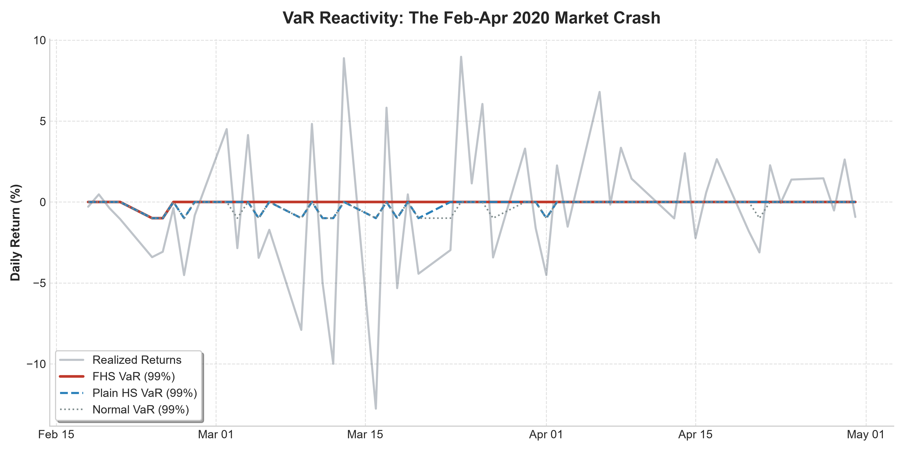
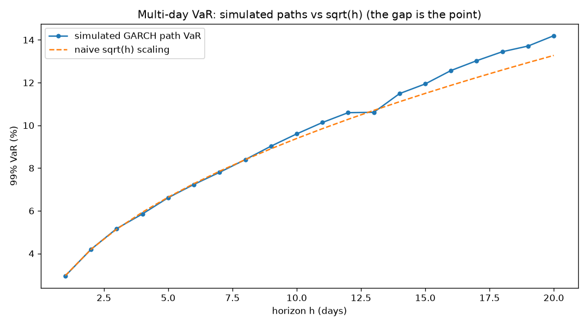

# Quantitative Risk Analytics: Filtered Historical Simulation


## Overview
An end-to-end Value-at-Risk (VaR) and Expected Shortfall (ES) engine using Filtered Historical Simulation. This methodology reacts instantly to market regimes like a parametric model, while utilizing empirical standardized residuals to capture true market skew and fat tails.

## Visual Evidence & Results

### 1. The Stylized Facts of Financial Returns
Empirical validation of the dataset (GSPC). The presence of excess kurtosis (fat tails) and strong autocorrelation in squared returns (volatility clustering) explicitly justifies the need for a GARCH-family conditional volatility model over Normal-parametric baselines.



### 2. Residual Diagnostics & Model Validation
For FHS to be mathematically valid, the standardized residuals must be approximately independent and identically distributed (i.i.d.). This diagnostic proves the EGARCH model successfully whitened the volatility (Ljung-Box test on squared residuals) and justifies resampling the empirical shocks.



### 3. VaR Reactivity: The 2020 Market Crash
The core theoretical advantage of FHS. During the Feb-Apr 2020 crash, the FHS VaR (Red) instantly scales to capture extreme market volatility. In stark contrast, the traditional Historical Simulation VaR (Blue Dashed) exhibits sluggishness and creates "ghost plateaus" long after the regime shifts.


*(Note: Alternate crisis overlay view below)*


### 4. Multi-Day Horizons and the $\sqrt{h}$ Fallacy
Demonstration of simulated multi-day GARCH paths. The naive square-root-of-time scaling rule fails under GARCH because volatility mean-reverts and leverage creates a skewed multi-day distribution. This engine properly simulates $h$-day risk via iterative variance recursions.



## Interactive Risk Lab
This project includes a custom-built dashboard built with Streamlit and Plotly. 

**To run the interactive lab locally:**
```bash
pip install -e .
streamlit run app/dashboard.py