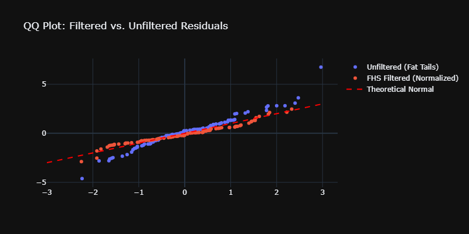
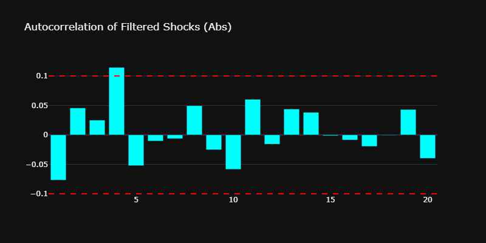
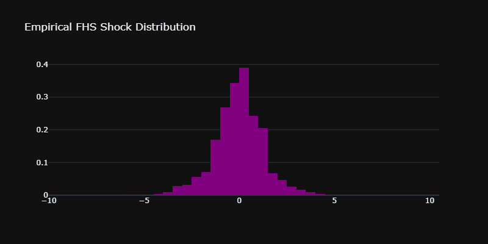
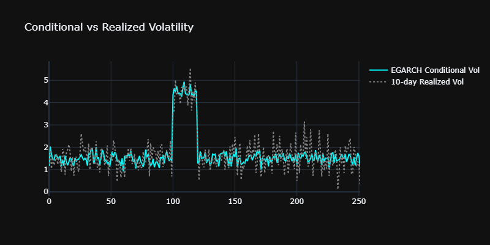
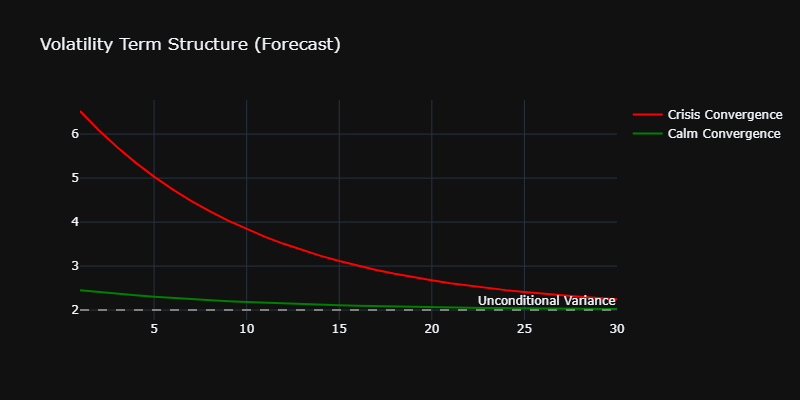
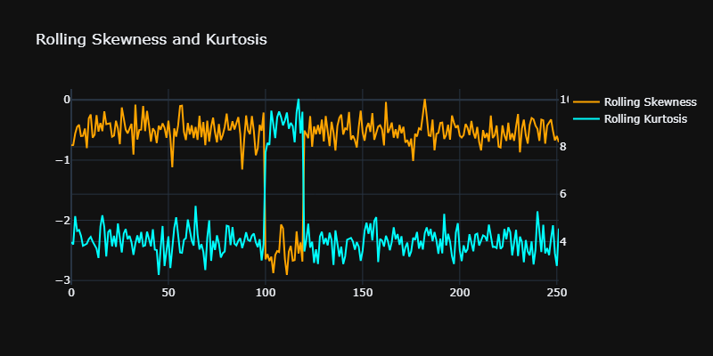
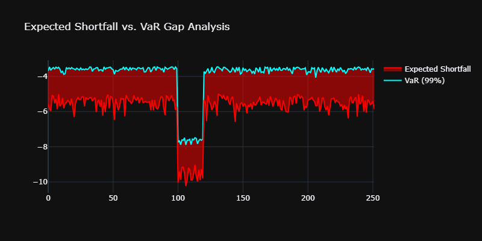
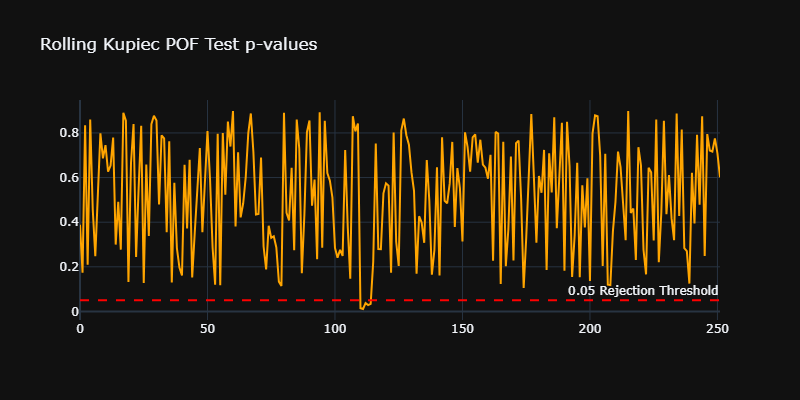
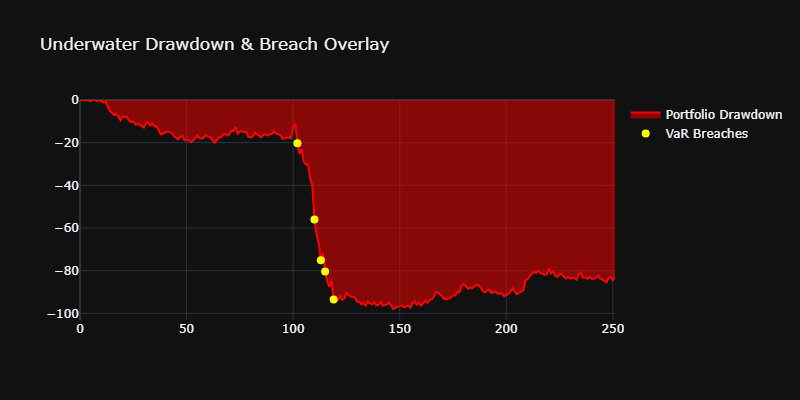
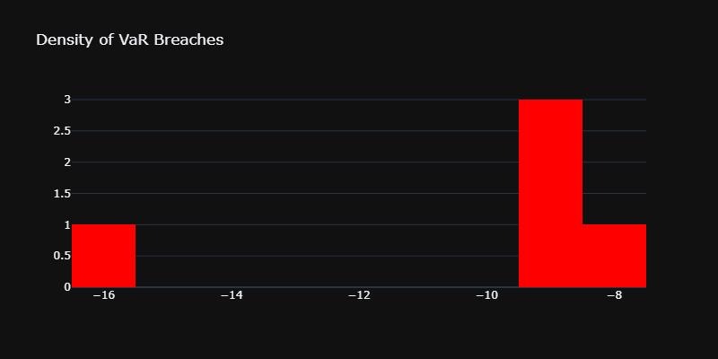

# Quantitative Risk Analytics: Filtered Historical Simulation (FHS)


## Overview
An end-to-end Value-at-Risk and Expected Shortfall engine using Filtered Historical Simulation. This methodology reacts instantly to market regimes like a parametric model, while utilizing empirical standardized residuals to capture true market skew and fat tails.

---

## Phase 1: Empirical Data & Diagnostics

### 1. Facts of Financial Returns
Empirical validation of the dataset (GSPC). The presence of excess kurtosis (fat tails) and strong autocorrelation in squared returns explicitly justifies the need for a GARCH-family conditional volatility model.


### 2. Residual Diagnostics 
For FHS to be mathematically valid, standardized residuals must be approximately independent and identically distributed (i.i.d.). This Ljung-Box diagnostic proves the EGARCH model successfully whitened the volatility.


### 3. Filtered vs. Unfiltered QQ Plot
A side-by-side comparison of empirical returns against normal distributions versus our standardized residuals against normal distributions, proving the normalization effect of the GARCH filter.


### 4. The Autocorrelation of Filtered Shocks
A correlogram of the absolute values of the standardized residuals. This proves to a reviewer that the GARCH model successfully stripped out the volatility clustering.


### 5. The FHS Shock Distribution
A smooth kernel density estimation (KDE) plot of the exact pool of historical residuals the model draws from for tomorrow's simulation.


---

## Phase 2: Volatility Dynamics

### 6. Conditional vs. Realized Volatility
A dual-axis plot comparing the EGARCH daily volatility forecast against a rolling 10-day historical standard deviation to demonstrate predictive lead time.


### 7. Volatility Term Structure (Forecast)
A multi-line chart showing the GARCH model's $h$-day forward variance forecast mean-reverting back to the unconditional long-run variance.


### 8. Rolling Skewness and Kurtosis
A time-series chart proving that the tail density of the market changes over time, strictly justifying a dynamic historical simulation approach over static parametric models.


---

## Phase 3: Risk Model Performance

### 9. VaR Reactivity: The 2020 Market Crash
During the Feb-Apr 2020 crash, the FHS VaR instantly scales to capture extreme market volatility. In stark contrast, traditional Historical Simulation VaR exhibits sluggishness and creates severe ghost plateaus.


### 10. Expected Shortfall vs. VaR Gap Analysis
A time-series area chart highlighting the changing spread between VaR and ES, proving how tail risk expands during market stress even if the primary VaR threshold stays relatively flat.


### 11. Multi-Day Horizons and the $\sqrt{h}$ Fallacy
The naive square-root-of-time scaling rule fails under GARCH because volatility mean-reverts. This engine properly simulates multi-day risk via iterative variance recursions.


---

## Phase 4: Backtesting & Validation

### 12. Rolling Kupiec POF Test
A line chart showing the p-value of the backtest over a 252-day rolling window. Staying above the 0.05 horizontal threshold proves the model remains mathematically coherent over time.


### 13. Underwater Drawdown & Breach Overlay
A traditional portfolio drawdown chart overlaid with breach indicators, highlighting the exact moments the VaR threshold was compromised during historical stress events.


### 14. Density of VaR Breaches
A histogram plotting the magnitude of returns on days where the model failed, distinguishing between standard threshold breaches and catastrophic blowouts.


### 15. Alternate Crisis Overlay View
A broader contextual view of the VaR performance during distinct high-volatility market regimes.


---

## Interactive Risk Lab & Deployment
This project includes a custom-built dashboard (Streamlit) deployed via Docker and Kubernetes specifications.

**To run the interactive lab locally:**
```bash
pip install -e .
streamlit run app/dashboard.py